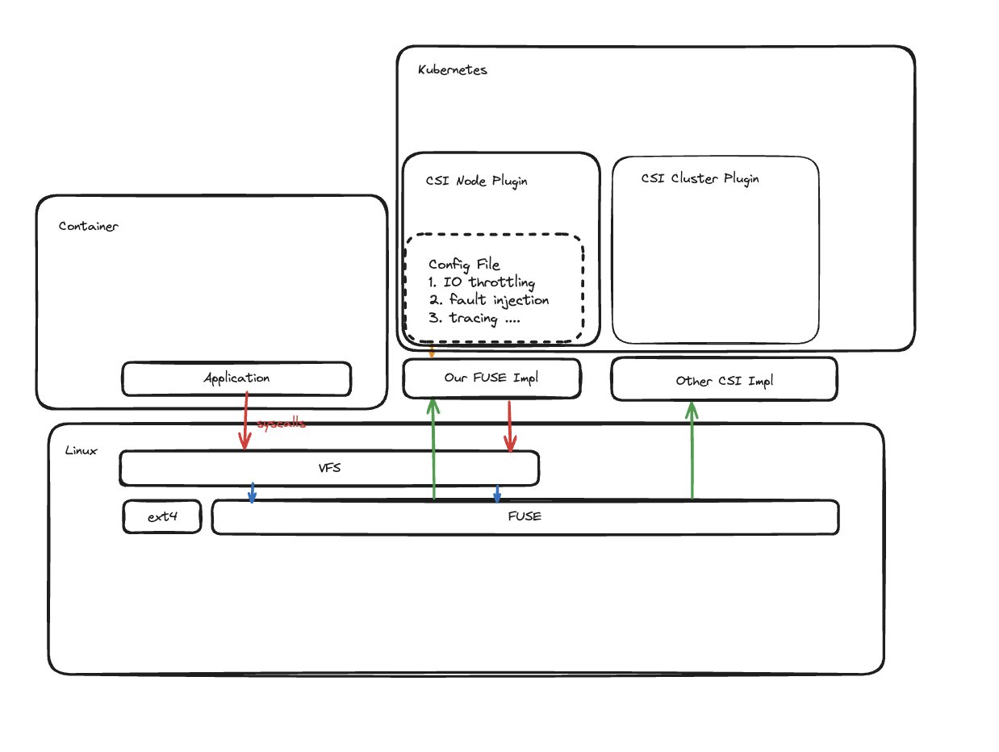

** **
## Sprint 1 Presentation [Here](https://drive.google.com/file/d/181ri_21EBSxvOOHjBrGhNJPuYTLsopJ7/view?usp=sharing)

# Container Native FS Interposer

**Team Members**: Julia Hua, Jiawei Xiang, Hilario Gonzalez, Shamir Legaspi, Juncheng Cao  
**Mentor**: Vasily Tarasov, Alex Merenstein  

## Project Description

## 1.   Vision and Goals Of The Project:

The goal of our project is to integrate FUSE file systems within the container-native environment Kubernetes, which is commonly used for deploying cloud-based applications. By leveraging the FUSE library, which provides the mechanisms and API for implementing file systems in user space, we aim to develop file systems with various testing utilities for Kubernetes applications. These utilities include workload tracing, workload metric collection, faulty I/O, throttle I/O, and fake I/O.

## 2. Users/Personas Of The Project:

The users of this project is anyone who is developing in or managing a cloud environment and need a file system that evaluates and tests the workload and its performance. 

### Cluster administrator at MOC - Steven

- Background and Role: Steven is the cluster admin of the MOC Openshift responsible for the performance and reliability of the share file systems.

- Needs and Goals: Steven wants to make sure all the applications running on the cluster still works fine during these monthly maintenances, since there can be degredation in latency/bandwidth during these events. He wants to minimize the impact on these applications by choosing the best maintenance windows. 

- Challenges: Steven doesn't have enough visibility into the filesystem access patterns of the applications.

### Researcher at BU - Nancy

- Background and Role: Nancy is a researcher at BU ECE, and her research is on AI.

- Needs and Goals: During the recent training sessions, the GPU server she manages is no longer of enough capacity. She is thinking of outsourcing the training to the cloud but is worried about the training performance since the storage latency is usually worse on the cloud. She wants to confirm the performance numbers before actually signing the contract.

- Challenges: Nancy needs an emulated cloud environment with arbitrarily worse storage performance to test things out.

### Developer at a large business - John

- Background and Role: John is the CTO of a grocery store called "Missing the Target". The company has a website for online ordering.

- Needs and Goals: John is worried about the stability of the website in case of filesystem failures because he has been cutting corners and buying second handed hard drives. He wants the website to still be accessible during failures, maybe in a degraded mode.

- Challenges: He wants to employ the idea of chaos enginnering and test fault tolerance of the system.

** **

## 3.   Scope and Features Of The Project:

### CSI Plugin
#### in-scope
- Node Controller
- Ephemeral Volumes
- ReadWriteOncePod
#### out-of-scope
- Cluster Controller
- Persistent Volumes
- ReadWriteOnce/ReadOnlyMany/ReadWriteMany

### FUSE
#### in-scope
- passthrough
- random fault
- throttle bandwidth
- random/fixed delay
- tracing with filtering
- metrics/IO accouting
- in memory fs
- /dev/null
#### out-of-scope
- persistent storage 
- metadata randomization
- quota

### Tracing/Metrics
#### in-scope
- latency
- thoughput
- failure rate
- dashboard
#### out-of-scope
- analysis

** **

## 4. Solution Concept

### Global Architectural Structure of the Project

The following diagram shows the general architecture of our project. The upper half of the diagram represents the user space, while the lower half represents the kernel space. The architecture demonstrates the integration of two systems, FUSE and Kubernetes, through a CSI plugin.

Diagram 1: General Architecture of Project

The FUSE library provides a mechanism and an API for implementing full-fledged file systems in user space, which makes developing a new file system significantly easier and safer compared to kernel based file systems. This also enables quick development of various “utility” file systems that layer on top of other file systems to add new functionalities.  For example, a file system that injects random errors to evaluate applications’ error handling, a file system that logs activity for later analysis or playback, or a file system that throttles I/O operations for quality of service (QoS) purposes or reducing the load on backend. The diagram above illustrates a request (i.e., system call) from userspace to the virtual file system (VFS) and subsequently the FUSE kernel module. FUSE then forwards these IO requests to the handler, which is our utility FUSE implementation. 

Applications are now often deployed in container native environments, such as Kubernetes.  In Kubernetes, storage is provided to workloads (“pods”) via volumes (“persistent volumes, PVs”) that are usually formatted with a file system such as ext4 or xfs.  To use a FUSE-based stackable utility file system with these volumes and workloads, some integration with Kubernetes is required. As shown in the diagram, this integration will be implemented by a CSI node plugin.

### Design Discussion

1. FUSE itself may introduce too much noise/overhead. This will be evaluated by running expriments with data-intensive applications.
2. CSI filesystems stacking would be a nice addition, if time allows.

## 5. Acceptance criteria

1. Create a new CSI plugin for Kubernetes that allows users to mount a stackable FUSE-based file system over another file system.

2. Implement utility FUSE file systems that provide workload tracing, workload metric collection, faulty I/O, throttle I/O, and fake IO.

3. Run experiments with several data-intensive applications using the 2 technologies above. Perform descriptive analysis of applications’ behavior when a utility file system is used.

## 6.  Release Planning:

1. Sprint 1
Research existing projects, learn k8s, grafana, prometheus, Go, C and FUSE.

Links for reference:
- https://kubernetes.io/docs/concepts/storage/storage-classes/
- https://kubernetes.io/docs/concepts/storage/ephemeral-volumes/
- https://kubernetes-csi.github.io/docs/introduction.html
- https://chaos-mesh.org/docs/simulate-io-chaos-on-kubernetes/
- https://github.com/chaos-mesh/toda
- https://grafana.com/
- https://opentelemetry.io/
- https://prometheus.io/

Artifacts:
- Diagrams for the system architecture
- A test kubernetes cluster with example CSI plugins/monitoring stack installed

2. Sprint 2
- Create scaffold for the CSI plugin
- Mount the passthrough FUSE filesystem

3. Sprint 3
- Implement new utility FUSE filesystems for throttling/fault injection/etc.
- Integrate the FUSE filesystems with CSI

4. Sprint 4
- Implement tracing and metrics with OTEL
- Implement a dashboard for visualizing these signals

5. Sprint 5
- Run experiments with data-intensive application

** **

